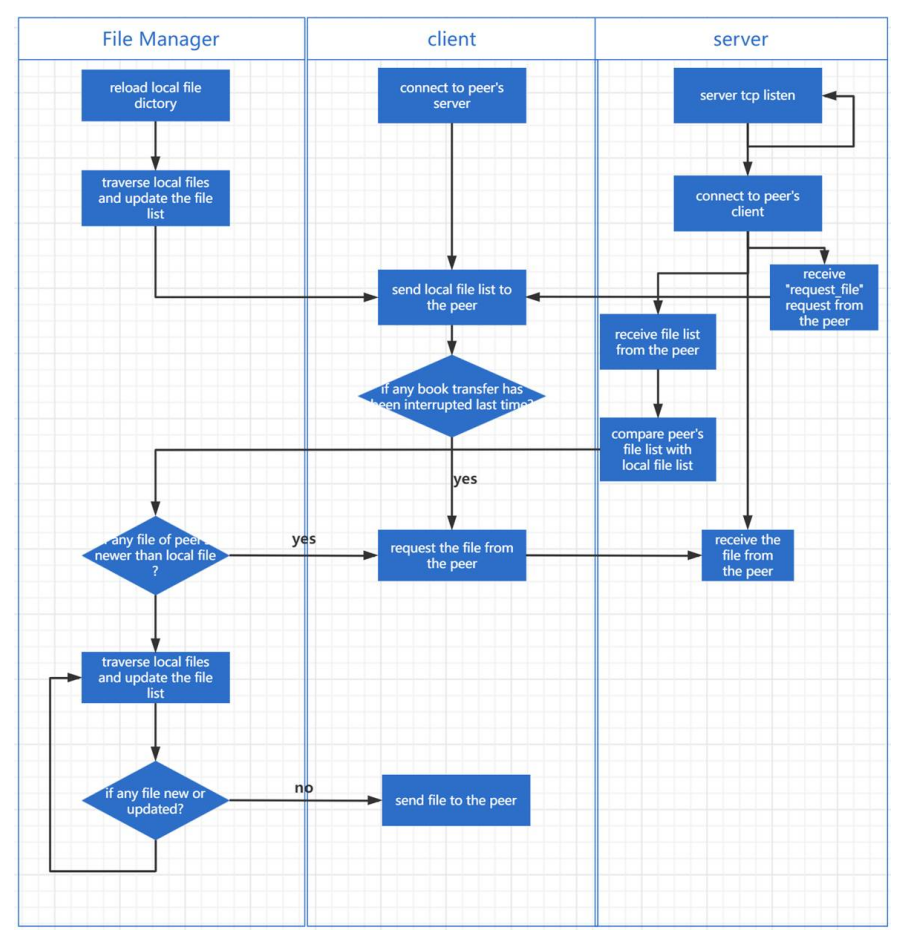

# Large-Efficient-Flexible-and-Trusty-LEFT-Files-Sharing

#### 1、项目要求

该项目需要实现一个大、高效、灵活和可靠的(左)文件共享应用程序通过python网络编程。“大”意味着它支持传输文件大于500MB的任何格式和文件夹。“高效”要求文件和文件夹可以高速自动同步。 “灵活”意味着文件可以被共享任何两个对等体和应用程序也支持从中断中恢复。“可靠的”是指文件可以在没有错误的情况下传输。

#### 2、项目结构

代码分为三部分:  

1. 服务器部分（server）: 服务器部分包括一个主服务器和许多服务器助理。 主服务器接收消息的报头字段并指定服务器助理来处理特定的业务。 服务器部分的主要业务是接收来自其他对等点和指定相关助理来处理请求。  

2. 客户端部分（client）: 客户端部分的主要功能是连接到指定对等体的服务器并发送给对等体的消息。  

3. 文件管理器部分（file Manager）: 文件管理器的主要业务是遍历本地文件。 如果有是否有文件更新，文件管理器更新本地文件列表，并调用客户端发送文件给对方。  

#### 3、传输协议设计

一般的通信过程是: 假设对等体A想向对等体B发送一个请求，客户端首先将报头字段的长度发送给B的主服务器。 然后，A的客户端发送报头到B的主服务器。 报头全部包括“action”字段和“body_len”字段，分别表示请求的目的和下面消息体的长度。 “action”字段的值可以是以下三种值之一:  

1. send_file_list: 

   

2. send_file: 

   

3. request_file: 

   

 然后，如果请求的动作是send_file_list或send_file, A的另一个客户端将尝试通过报头字段中指定的端口连接到B。一旦连接建立，A客户端将发送文件列表或文件到B的服务器助手。除此之外，如果请求被发送到request_file, A的主服务器只需要等待B连接并接收到特定的文件。 

> 全流程如下图

#### 4、遇到的困难及相应的解决措施

1. 最初的设计为只有一个服务端，长连接处理完整的请求过程。当文件共享应用程序意外中断并再次执行时可能会出现“[Errno 98] Address already in use”这样的错误。检测到在目标端口中，发现服务器端TCP连接中断处于一种“时间等待”的状态，导致无法接受新的请求。 

   –> 因而最终版本修改为：主要的tcp服务器只接收报头字段和具体业务处理委托给服务器助手。 此外，连接关闭。这样服务器就不会处于“TIME WAIT”的状态。  

2. 有时会显示“内存错误”或程序意外退出  任何异常显示。  程序意外退出的问题只在程序时遇到是在Linux系统中运行的。 检查系统日志后，发现程序  被系统杀死，因为OOM，简称出内存，这是一个Linux中的自我保护机制是指系统在主动终止进程时  进程占用过多内存。

   –> 因此，在最终版本的代码设计中，一个文件被分成几个固定大小的块，然后将这些块传输给对方。 

#### 5、测试和结果展示

###### （1）测试环境

 代码在两个Linux虚拟机(Tiny Core)中测试:使用python 3.6的PC_A, PC_B。 

###### （2）测试计划

1. 对于每个虚拟机，应用程序将以`python3 main.py ip 192.168.xxx.xxx` 的方式启动。 
2. PC_A上的应用程序将首先启动，并将一个File_1(10MB)添加到PC_A当前工作目录的共享文件夹中。
3. PC_B启动应用程序，并在10秒内从PC_A获得File_1。
4. 在PC_B当前工作目录的共享文件夹中增加一个File_2(约500MB)和一个包含50个小文件(1KB)的文件夹，并同步到PC_A。
5. 在步骤4的0.5秒后，PC_A上的应用程序将被中断，通常会有一些文件没有被完全传输。
6. PC_A上的应用程序将再次执行，所有未传输到PC_A的文件将再次传输。
7. PC_A上至少10%的File_2将被随机更新。
8. 更新后的File_2将在50秒后传输到PC_B。
9. 记录文件的md5值和传输的所有文件的耗时。 

###### （3）测试结果

#### 6、改进措施

为了进一步研究，还会增加文件加密功能，以增加文件的安全性共享。 此外，应用程序将验证文件传输的正确性和是否有传输错误发生时，重新传输文件以提高应用程序的可靠性。  
